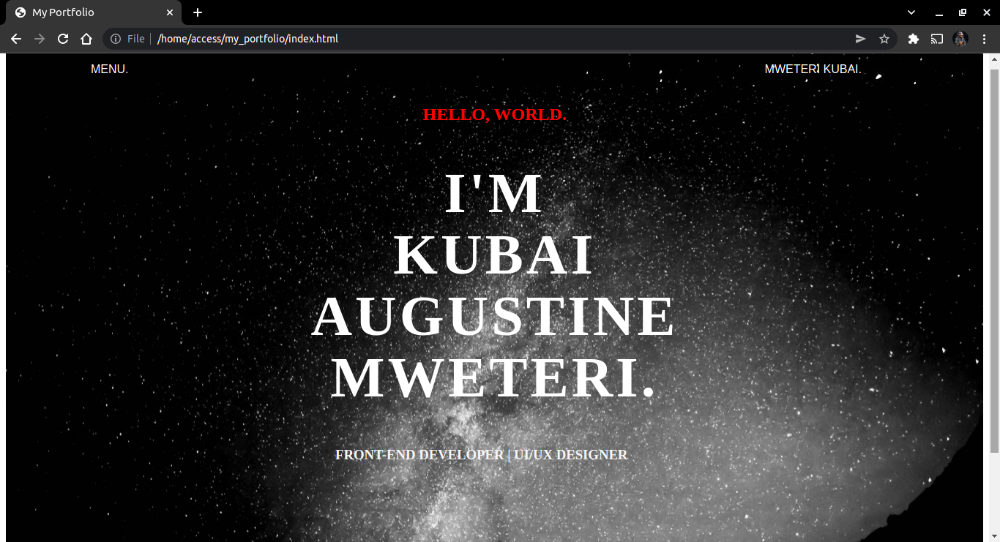
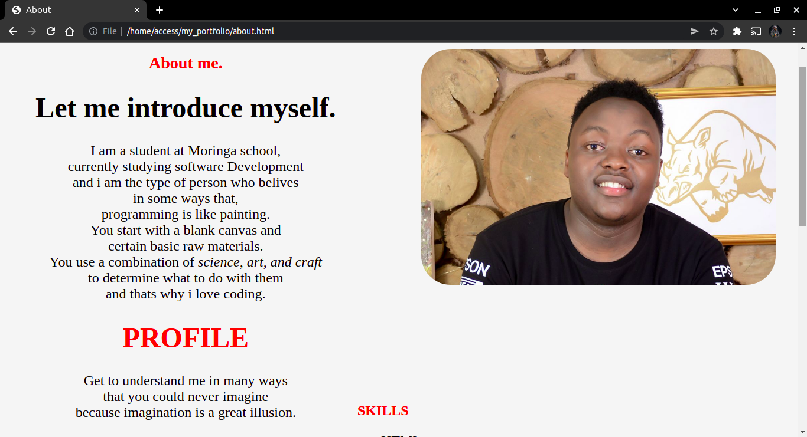
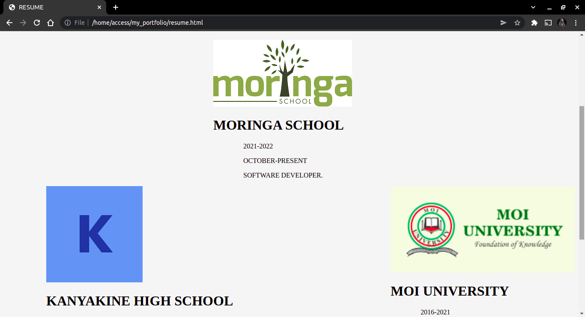
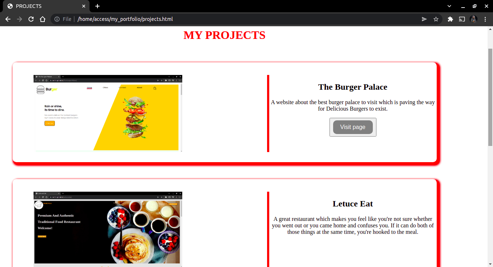
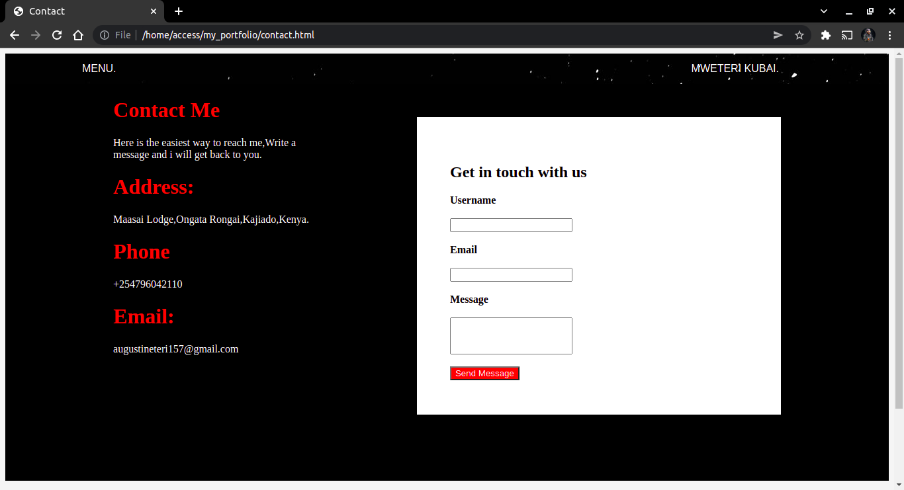

## My Portfolio
A personal portfolio website build based on HTML and CSS.5/12/2021

By Kubai Augustine Mweteri

## Description
This is my personal prfolio contains information about me and my skills and achievement .It contains my resume and links to the projects i have worked on so far .It is like my online resume .
## Design
 alt="home">
 alt="about">
 alt="education">
 alt="projects">
 alt="contact">

## Setup/Installation Requirements
1)Install the Visual studio code 2)Git clone the repository 3)Make sure the live server extension is installed 4)Click on Go live

## Todo list
1)Design 2)Execute for view.

## Known Bugs
The Website works just fine,there are no bugs.
## Technologies Used
1)HTML  2)CSS.
## Support and contact details
Email Address;augustineteri157@gmail.com

### License
Copyright (c) [2021] [Kubai Augustine Mweteri] Permission is hereby granted, free of charge, to any person obtaining a copy of this software and associated documentation files (the "Software"), to deal in the Software without restriction, including without limitation the rights to use, copy, modify, merge, publish, distribute, sublicense, and/or sell copies of the Software, and to permit persons to whom the Software is furnished to do so, subject to the following conditions:

The above copyright notice and this permission notice shall be included in all copies or substantial portions of the Software.

THE SOFTWARE IS PROVIDED "AS IS", WITHOUT WARRANTY OF ANY KIND, EXPRESS OR IMPLIED, INCLUDING BUT NOT LIMITED TO THE WARRANTIES OF MERCHANTABILITY, FITNESS FOR A PARTICULAR PURPOSE AND NONINFRINGEMENT. IN NO EVENT SHALL THE AUTHORS OR COPYRIGHT HOLDERS BE LIABLE FOR ANY CLAIM, DAMAGES OR OTHER LIABILITY, WHETHER IN AN ACTION OF CONTRACT, TORT OR OTHERWISE, ARISING FROM, OUT OF OR IN CONNECTION WITH THE SOFTWARE OR THE USE OR OTHER DEALINGS IN THE SOFTWARE.
  
  